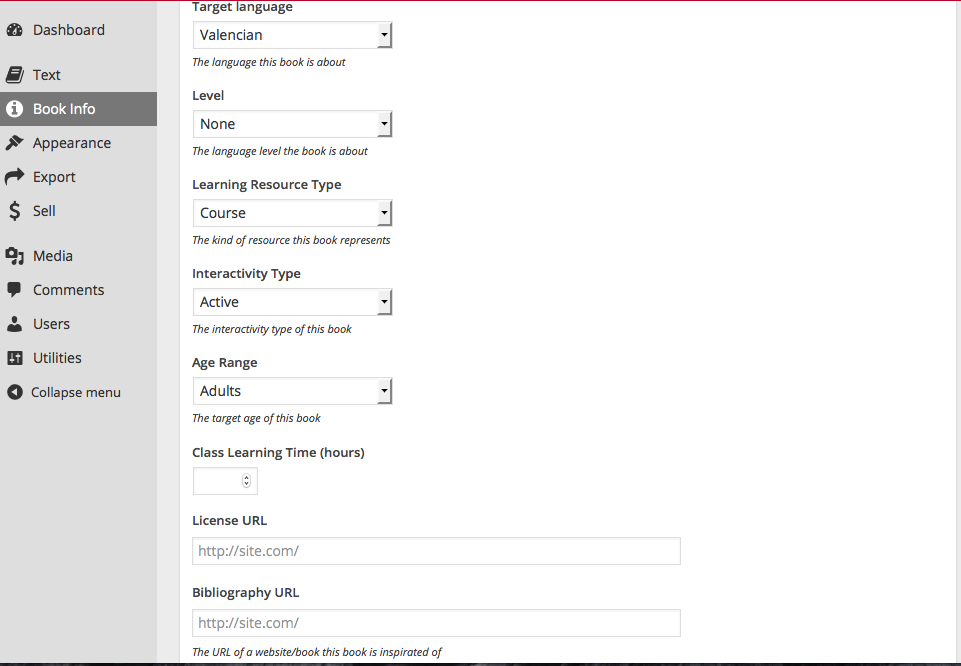
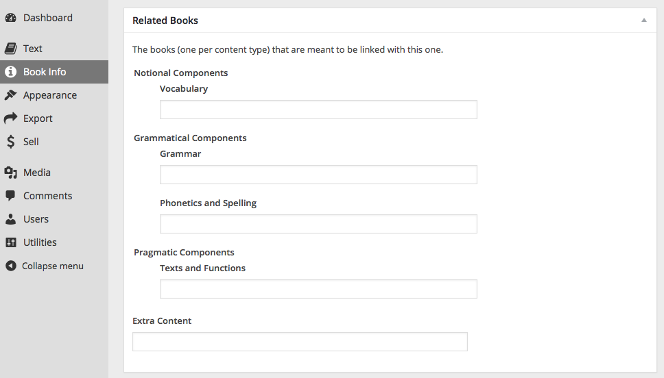
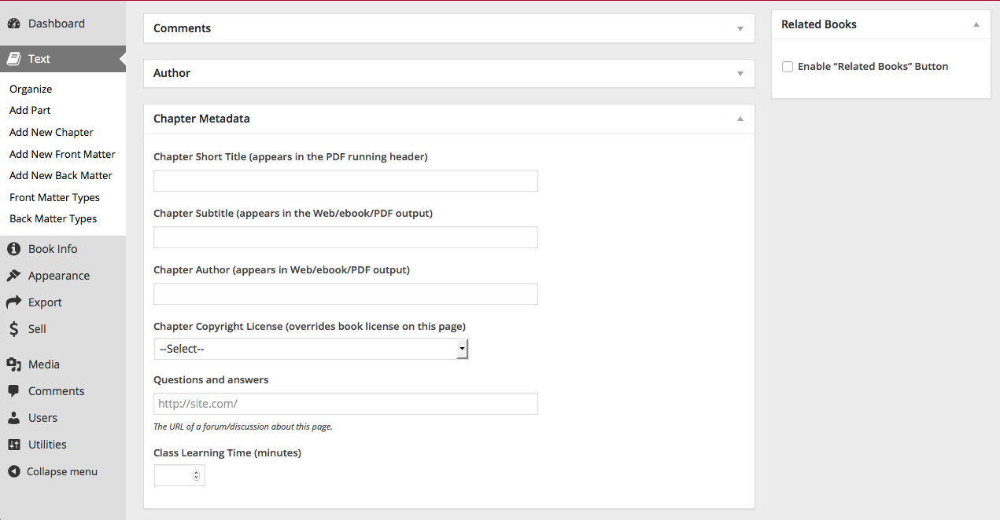
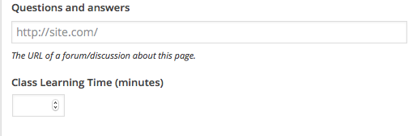
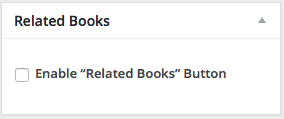

# Pressbooks-Metadata

## Descrtiption
Adds useful navigation and semantic features to PressBooks.

1. Adds Metadata
1. Adds Related Books with an integrated navigation menu
1. Adds Question and Answer forum for each page

## Requirements

This plugin uses some features from PressBooks, thus you should have installed and activated this plugin (tested on 2.4.2).

##Installation

1. Clone (or copy) this repository to the /wp-content/plugins/ directory
1. Activate the plugin through the 'Plugins' menu in WordPress

## Screenshots

### 1. The added Metadata

### 2 The added of Related Books

###  1-2-3 New options in authors writig page

### 1.1 New Metadata in writing page

### 2.1 Activate Related Books for the page

### 3 Questions and Answer forum page link

## Changelog

### 0.1
* Initial version.

## Credits

Uses the [WordPress Plugin Boilerplate](http://wppb.io/).

