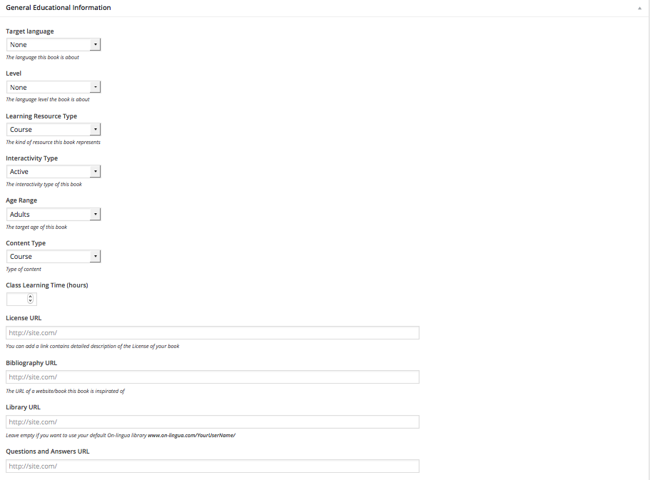
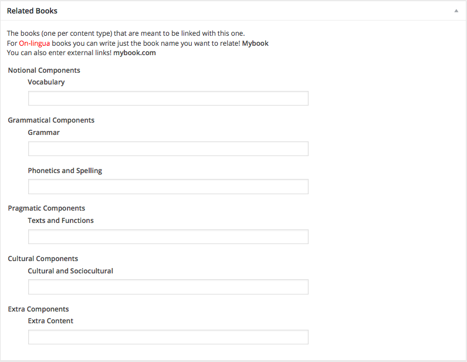

# Pressbooks-Metadata

## Description
Extended features for Pressbooks (Metadata and Theme)

### About

With PressBooks-Metadata for Wordpress you can add metadata in the books. Also use the template for show extra information.

We want to make the language courses more user-friendly. This is the second step.

**Because the second step for teaching is also organizing the ideas.**

### General Information
[Read general teorical information](/README-general-information.md).

## Requirements
This is a plugin for Wordpress (tested on 4.3)

This plugin uses some styles from PressBooks, thus you should have installed and
activated this plugin (tested on 2.4.5).

## Installation

1. Clone (or copy) this repository to the `/wp-content/plugins/` directory
1. Activate the plugin through the 'Plugins' menu in WordPress

## Screenshots

### Book Information in the dashboard.

## Changelog
### 1.0
* tweak: New pop up for “link to a box”.
* tweak: Change the bottom for link copy.
* Fix several bugs.

### 0.2 to 0.9
* Caos in the developing process

### 0.1
* Initial version.

## Credits

Uses the [WordPress Plugin Boilerplate](http://wppb.io/).
